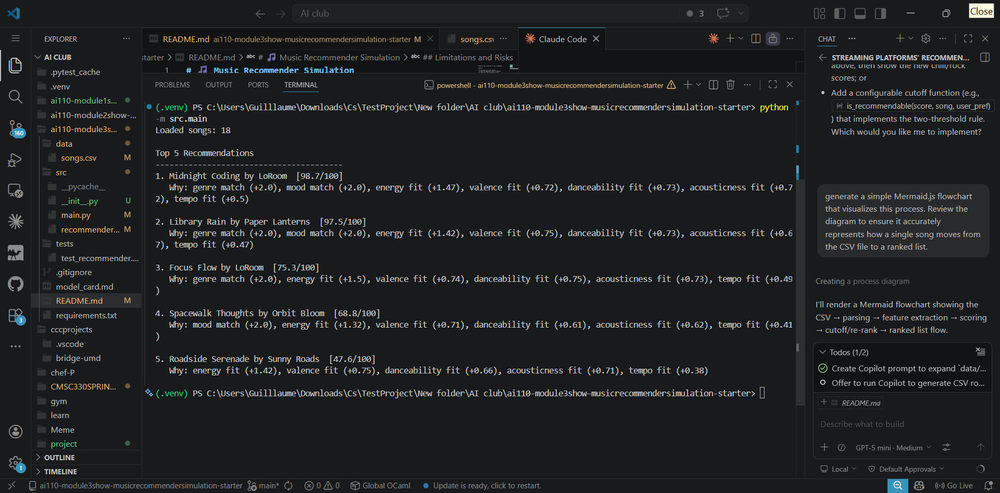

# 🎵 Music Recommender Simulation

## Project Summary

This project is a music recommender called VibeMatch 1.0.

It reads a catalog of 18 songs and a user taste profile, scores every song, and returns the top 5 best matches.

Each result shows a score out of 100 and a reason — like "genre match" or "energy fit" — so you can see exactly why a song was picked.

It is a classroom simulation. It does not learn from listening history or talk to any outside service.

---

## How The System Works

Real apps like Spotify learn from everything you do — what you skip, when you listen, what similar users like. They use two big strategies: matching song features to your taste, and borrowing ideas from people who listen like you. They also quietly boost popular songs, so unknown tracks rarely surface even if they would be a perfect fit.

This version only does the first part — matching song features to a user profile. It does not learn from history and does not know what other users like. Every result can be explained with a number, so it is easy to see exactly why a song ranked where it did.

### Algorithm Recipe

Each song is scored against the user profile using the following steps:

| Feature | How it's scored | Max points |
|---|---|---|
| Genre match | +1.0 if song genre == user's favorite genre | 1.0 |
| Mood match | +2.0 if song mood == user's favorite mood | 2.0 |
| Energy | `(1 - │song.energy − target_energy│) × 3.0` | 3.0 |
| Valence | `(1 - │song.valence − target_valence│) × 0.75` | 0.75 |
| Danceability | `(1 - │song.danceability − target_danceability│) × 0.75` | 0.75 |
| Acousticness | `(1 - │song.acousticness − target_acousticness│) × 0.75` | 0.75 |
| Tempo | `(1 - │song.tempo_bpm − target_tempo_bpm│ / 100) × 0.5` (only if target is set) | 0.5 |

All negative intermediate values are clamped to 0. The raw total (max 8.75) is then scaled to a 0–100 score:

```
final_score = (raw / 8.75) × 100
```

Songs are ranked by final score and the top `k` (default 5) are returned.

### Potential Biases

- **Mood dominates.** Mood is worth 2.0 points, more than any other single feature. A song with the wrong mood rarely makes the top 5.
- **No popularity signal.** A song with 10 streams scores the same as one with 10 million. That is fairer, but it also means the system cannot fall back on "most people like this."
- **Same weights for everyone.** Everyone gets the same formula. A user who only cares about tempo still gets mood-heavy results.
- **Exact label matching.** Genre and mood are string comparisons. A song tagged "lo-fi" scores zero for a user who wants "lofi" even if the songs sound the same.

---


## Getting Started

### Setup

1. Create a virtual environment (optional but recommended):

   ```bash
   python -m venv .venv
   source .venv/bin/activate      # Mac or Linux
   .venv\Scripts\activate         # Windows

2. Install dependencies

```bash
pip install -r requirements.txt
```

3. Run the app:

```bash
python -m src.main
```

### Running Tests

Run the starter tests with:

```bash
pytest
```

You can add more tests in `tests/test_recommender.py`.

---

## Experiments You Tried

Six user profiles were run against the 18-song catalog. Take a screenshot of your own terminal output and paste it below each profile heading.

---

==================================================
  Profile: High-Energy Pop
==================================================
1. Sunrise City by Neon Echo  [96.6/100]
   Why: genre match (+2.0), mood match (+2.0), energy fit (+1.38), valence fit (+0.74), danceability fit (+0.71), acousticness fit (+0.69), tempo fit (+0.45)

2. Gym Hero by Max Pulse  [73.5/100]
   Why: genre match (+2.0), energy fit (+1.46), valence fit (+0.69), danceability fit (+0.73), acousticness fit (+0.71), tempo fit (+0.48)

3. Rooftop Lights by Indigo Parade  [70.1/100]
   Why: mood match (+2.0), energy fit (+1.29), valence fit (+0.72), danceability fit (+0.73), acousticness fit (+0.56), tempo fit (+0.48)

4. Photon Pulse by Electra Unit  [48.3/100]
   Why: energy fit (+1.5), valence fit (+0.53), danceability fit (+0.73), acousticness fit (+0.73), tempo fit (+0.5)

5. City Cipher by Neon Rhymes  [46.3/100]
   Why: energy fit (+1.42), valence fit (+0.6), danceability fit (+0.71), acousticness fit (+0.75), tempo fit (+0.33)


==================================================
  Profile: Chill Lofi
==================================================
1. Midnight Coding by LoRoom  [98.7/100]
   Why: genre match (+2.0), mood match (+2.0), energy fit (+1.47), valence fit (+0.72), danceability fit (+0.73), acousticness fit (+0.72), tempo fit (+0.5)

2. Library Rain by Paper Lanterns  [97.5/100]
   Why: genre match (+2.0), mood match (+2.0), energy fit (+1.42), valence fit (+0.75), danceability fit (+0.73), acousticness fit (+0.67), tempo fit (+0.47)

3. Focus Flow by LoRoom  [75.3/100]
   Why: genre match (+2.0), energy fit (+1.5), valence fit (+0.74), danceability fit (+0.75), acousticness fit (+0.73), tempo fit (+0.49)

4. Spacewalk Thoughts by Orbit Bloom  [68.8/100]
   Why: mood match (+2.0), energy fit (+1.32), valence fit (+0.71), danceability fit (+0.61), acousticness fit (+0.62), tempo fit (+0.41)

5. Roadside Serenade by Sunny Roads  [47.6/100]
   Why: energy fit (+1.42), valence fit (+0.75), danceability fit (+0.66), acousticness fit (+0.71), tempo fit (+0.38)


==================================================
  Profile: Deep Intense Rock
==================================================
1. Storm Runner by Voltline  [97.8/100]
   Why: genre match (+2.0), mood match (+2.0), energy fit (+1.48), valence fit (+0.61), danceability fit (+0.74), acousticness fit (+0.73), tempo fit (+0.49)

2. Gym Hero by Max Pulse  [67.8/100]
   Why: mood match (+2.0), energy fit (+1.48), valence fit (+0.4), danceability fit (+0.58), acousticness fit (+0.73), tempo fit (+0.41)

3. Thunderforge by Iron Vale  [47.7/100]
   Why: energy fit (+1.46), valence fit (+0.64), danceability fit (+0.71), acousticness fit (+0.73), tempo fit (+0.4)

4. Photon Pulse by Electra Unit  [45.1/100]
   Why: energy fit (+1.47), valence fit (+0.56), danceability fit (+0.58), acousticness fit (+0.72), tempo fit (+0.39)

5. Night Drive Loop by Neon Echo  [42.3/100]
   Why: energy fit (+1.24), valence fit (+0.61), danceability fit (+0.69), acousticness fit (+0.65), tempo fit (+0.3)


==================================================
  Profile: Adversarial: Conflicting Vibes (high energy + chill mood)
==================================================
1. Midnight Coding by LoRoom  [88.9/100]
   Why: genre match (+2.0), mood match (+2.0), energy fit (+0.75), valence fit (+0.7), danceability fit (+0.66), acousticness fit (+0.72), tempo fit (+0.5)

2. Library Rain by Paper Lanterns  [86.6/100]
   Why: genre match (+2.0), mood match (+2.0), energy fit (+0.64), valence fit (+0.68), danceability fit (+0.69), acousticness fit (+0.67), tempo fit (+0.47)

3. Focus Flow by LoRoom  [64.2/100]
   Why: genre match (+2.0), energy fit (+0.72), valence fit (+0.68), danceability fit (+0.68), acousticness fit (+0.73), tempo fit (+0.49)

4. Spacewalk Thoughts by Orbit Bloom  [59.3/100]
   Why: mood match (+2.0), energy fit (+0.54), valence fit (+0.64), danceability fit (+0.68), acousticness fit (+0.62), tempo fit (+0.41)

5. Roadside Serenade by Sunny Roads  [40.0/100]
   Why: energy fit (+0.8), valence fit (+0.68), danceability fit (+0.73), acousticness fit (+0.71), tempo fit (+0.38)


==================================================
  Profile: Adversarial: Ghost Genre (genre not in catalog)
==================================================
1. Sunrise City by Neon Echo  [74.1/100]
   Why: mood match (+2.0), energy fit (+1.47), valence fit (+0.72), danceability fit (+0.74), acousticness fit (+0.69), tempo fit (+0.49)

2. Rooftop Lights by Indigo Parade  [72.2/100]
   Why: mood match (+2.0), energy fit (+1.44), valence fit (+0.74), danceability fit (+0.74), acousticness fit (+0.56), tempo fit (+0.48)

3. City Cipher by Neon Rhymes  [47.7/100]
   Why: energy fit (+1.43), valence fit (+0.64), danceability fit (+0.75), acousticness fit (+0.75), tempo fit (+0.38)

4. Gym Hero by Max Pulse  [47.0/100]
   Why: energy fit (+1.3), valence fit (+0.73), danceability fit (+0.69), acousticness fit (+0.71), tempo fit (+0.44)

5. Photon Pulse by Electra Unit  [46.0/100]
   Why: energy fit (+1.35), valence fit (+0.56), danceability fit (+0.69), acousticness fit (+0.73), tempo fit (+0.46)


==================================================
  Profile: Adversarial: All Neutral (no genre/mood, all features at 0.5)
==================================================
1. Roadside Serenade by Sunny Roads  [41.6/100]
   Why: energy fit (+1.42), valence fit (+0.68), danceability fit (+0.73), acousticness fit (+0.6)

2. Midnight Coding by LoRoom  [40.5/100]
   Why: energy fit (+1.38), valence fit (+0.7), danceability fit (+0.66), acousticness fit (+0.59)

3. Focus Flow by LoRoom  [39.4/100]
   Why: energy fit (+1.35), valence fit (+0.68), danceability fit (+0.68), acousticness fit (+0.54)

4. Delta Blue by M. Rivers  [38.2/100]
   Why: energy fit (+1.35), valence fit (+0.69), danceability fit (+0.6), acousticness fit (+0.51)

5. Library Rain by Paper Lanterns  [37.8/100]
   Why: energy fit (+1.27), valence fit (+0.68), danceability fit (+0.69), acousticness fit (+0.48)
---

## Limitations and Risks

- Only works on 18 songs. Most genre searches return the same #1 every time because each genre has just one or two songs.
- Does not understand lyrics, language, or cultural context at all.
- The genre and mood labels are the most powerful thing in the scoring. A mislabeled song will always rank badly.
- A user with no genre or mood preference gets near-random results — the scores cluster within 5 points of each other.
- No diversity controls. If 10 songs were all lofi, a lofi user could get all 10 in the top 10 with no variety.

---

## Reflection

[**Model Card**](model_card.md)

Building this showed me that a recommender does not need to be complicated to produce real results. It is just math — add up how close each song is to what the user wants, then sort. The tricky part is deciding what to weight more.

The biggest thing I learned is that labels like genre and mood carry a lot of hidden power. A song can match perfectly on energy and tempo but still rank 20th because it has the wrong genre tag. That made me think about how much of what Spotify recommends is based on how a song is categorized, not how it actually sounds.

The conflicting preferences test was the most surprising. Even when a user clearly asked for high energy, the system ignored it because the genre label was worth more points. That is the kind of quiet failure that would frustrate a real user and they would have no idea why it happened.


---

## 7. `model_card_template.md`

Combines reflection and model card framing from the Module 3 guidance. :contentReference[oaicite:2]{index=2}  

```markdown
# 🎧 Model Card - Music Recommender Simulation

## 1. Model Name

Give your recommender a name, for example:

> VibeFinder 1.0

---

## 2. Intended Use

- What is this system trying to do
- Who is it for

Example:

> This model suggests 3 to 5 songs from a small catalog based on a user's preferred genre, mood, and energy level. It is for classroom exploration only, not for real users.

---

## 3. How It Works (Short Explanation)

Describe your scoring logic in plain language.

- What features of each song does it consider
- What information about the user does it use
- How does it turn those into a number

Try to avoid code in this section, treat it like an explanation to a non programmer.

---

## 4. Data

Describe your dataset.

- How many songs are in `data/songs.csv`
- Did you add or remove any songs
- What kinds of genres or moods are represented
- Whose taste does this data mostly reflect

---

## 5. Strengths

Where does your recommender work well

You can think about:
- Situations where the top results "felt right"
- Particular user profiles it served well
- Simplicity or transparency benefits

---

## 6. Limitations and Bias

Where does your recommender struggle

Some prompts:
- Does it ignore some genres or moods
- Does it treat all users as if they have the same taste shape
- Is it biased toward high energy or one genre by default
- How could this be unfair if used in a real product

---

## 7. Evaluation

How did you check your system

Examples:
- You tried multiple user profiles and wrote down whether the results matched your expectations
- You compared your simulation to what a real app like Spotify or YouTube tends to recommend
- You wrote tests for your scoring logic

You do not need a numeric metric, but if you used one, explain what it measures.

---

## 8. Future Work

If you had more time, how would you improve this recommender

Examples:

- Add support for multiple users and "group vibe" recommendations
- Balance diversity of songs instead of always picking the closest match
- Use more features, like tempo ranges or lyric themes

---

## 9. Personal Reflection

A few sentences about what you learned:

- What surprised you about how your system behaved
- How did building this change how you think about real music recommenders
- Where do you think human judgment still matters, even if the model seems "smart"

